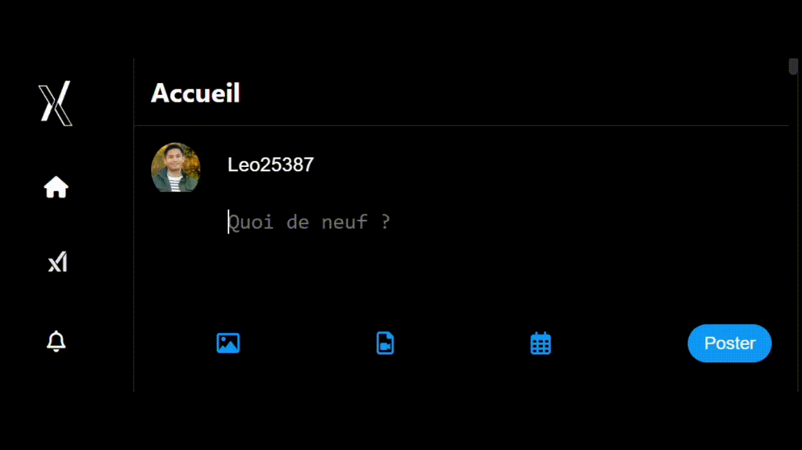

# Clone-X - Clone de Twitter

Clone-X est un site web qui réplique les principales fonctionnalités de Twitter. Ce projet est conçu pour démontrer la création d'une plateforme de microblogging avec des technologies modernes. Il permet aux utilisateurs de de publier des tweets, de suivre d'autres utilisateurs et d'interagir avec leurs publications.

## 📸 Logo

## 📲 Aperçu

## 📚 Table des Matières

- [📸 Logo](#-logo)
- [📲 Aperçu](#-aperçu)
- [🚀 Fonctionnalités](#-fonctionnalités)
- [🤖 AI](#-ai)
- [🛠️ Technologies utilisées](#%EF%B8%8F-technologies-utilisées)
- [🛤️ Feuille de route](#%EF%B8%8F-feuille-de-route)
- [📄 Licence](#-licence)
- [📊 Statistiques](#-statistiques)
- [🔒 Sécurité](#-sécurité)
- [🤝 Contribuer](#-contribuer)
- [🐞 Problèmes ouverts](#-problèmes-ouverts)
- [📞 Contact](#-contact)
- [🙏 Remerciements](#-remerciements)

## 🚀 Fonctionnalités

- Publier des tweets
- Suivre et être suivi par d'autres utilisateurs
- Liker et retweeter des publications
- Interface utilisateur responsive et moderne
- Discuter avec Grok

## 🤖 AI
- 🤯 Tester Grock AI copie sur X-copie
## 

## 🛠️ Technologies utilisées
- Frontend : HTML, CSS, JavaScript (local-storage)

## 🛤️ Feuille de route

Voici quelques-unes des prochaines fonctionnalités à venir pour Clone-X :

- Ajouter un système de notifications en temps réel.
- Implémenter un mode sombre.
- Améliorer l'optimisation mobile.

## 📄 Licence

Ce projet est sous licence [MIT](LICENSE).

## 📊 Statistiques

    

## 🔒 Sécurité

La sécurité des données des utilisateurs est une priorité pour Clone-X. Nous ne récupérons pas vos données.

## 🤝 Contribuer

Pour savoir comment contribuer au projet, veuillez consulter notre [guide de contribution](CONTRIBUTING.md).

## 🐞 Problèmes ouverts

Nous encourageons la communauté à signaler tout bug ou à soumettre des propositions d'amélioration. Consultez les [problèmes ouverts](https://github.com/Leo25387/Clone-X/issues) pour plus d'informations.

## 📞 Contact

Si vous avez des questions ou des suggestions, vous pouvez me contacter à [Leolebg1999@gmail.com](mailto🥇leolebg1999@gmail.com).

Vous pouvez suivre le projet ici sur [GitHub](https://github.com/Leo25387/Clone-X).

## 🎉 Remerciements

Toutes les contributions sont appréciées ! Que vous ayez corrigé un bug, ajouté une fonctionnalité ou amélioré la documentation, chaque effort fait une grande différence.

Les contributeurs les plus actifs auront leur nom mentionné dans la section "Remerciements" du `README.md`.

## 🙏 Remerciements

Merci à [Nouvy](https://github.com/Nouvy) et [fabrice](https://github.com/fabriceHategekimana) pour leur soutien et leurs contributions à ce projet.
